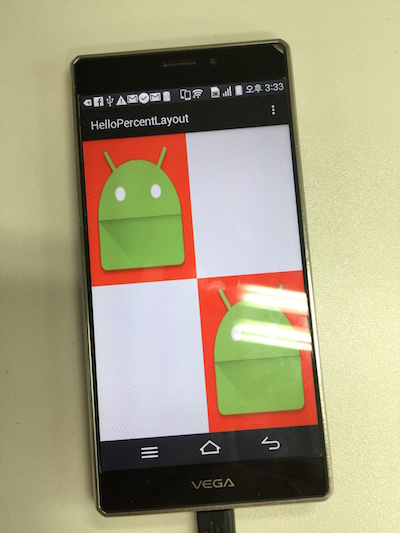

# Intro

This is an example of a Percent Layout which is added to android support library 23.0.0.
You can read a tutorial about PercentLayout at [my blog](http://blog.burt.pe.kr/hello-percentlayout/)

## Result

